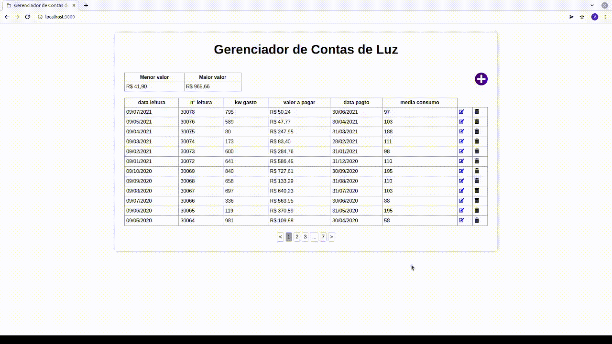

# 5PJS-ativ-conta-de-luz-frontend

Atividade proposta pelo professor Ricardo Marciano da FAETERJ-Rio.

## Cenário
As informações a seguir se referem à planilha Excel de um usuário, que controla os gastos mensais com sua conta de luz. Para cada conta de luz cadastra-se: data em que a leitura do relógio de luz foi realizada, número da leitura, quantidade de Kw gasto no mês, valor a pagar pela conta, data do pagamento e média de consumo. Mensalmente, são realizadas as seguintes pesquisas:
  - verificação do mês de menor consumo;
  - verificação do mês de maior consumo.

## Passo a passo para clonar e iniciar o projeto:
    # clona o repositório
    g clone https://github.com/vitormcferreira/5PJS-ativ-conta-de-luz-frontend

    # entra na pasta do repositório
    cd 5PJS-ativ-conta-de-luz-frontend

    # inicia o ambiente virtual e instala as dependências
    npm i

    # inicia o servidor (demora um pouco)
    npm start

Após iniciar o servidor, ele estará disponível em `http://locahost:3000` .

## TODO
  - Validação frontend
